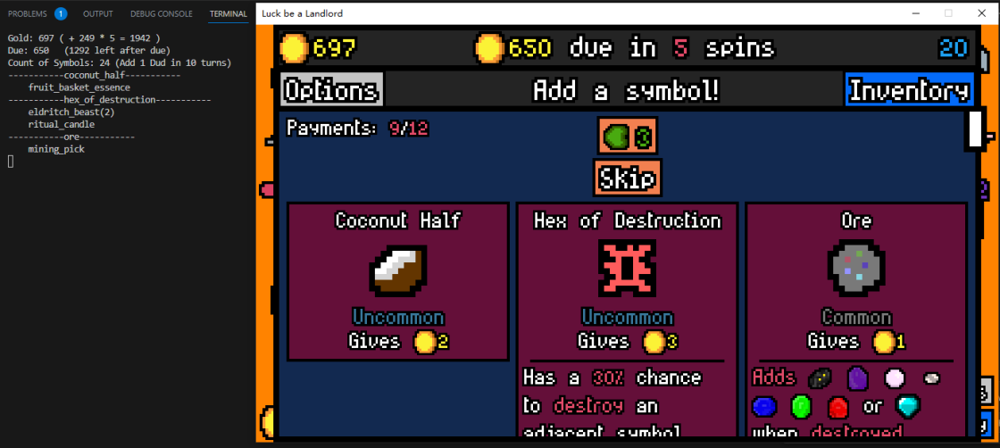

# LBAL Reminder
Reminder tool for Luck Be A Landlord. Displays recommendations at choice screen.



## How to run
To run this, install Python3 first, then execute `run.bat`, or enter `python3 main.py` in your terminal. You may need to add python3 to `path` in `environment variable` settings.

## How to modify recommendations
Recommendations are calculated from your inventory, item/symbol choices, and the **links** in between. Links can be added symbols-symbol, item-symbol, or item-item. Links are generated from `symbols.json`, `items.json` and `essences.json`. 

Links are calculated by `linki`, `linkg`, `addi`, `addg` and `linkcg` properties.

### linki
```
{
    ...
    "goldfish": {
        ...
        "linki": ["bubble"]
    }
}
```
That links `goldfish` to `bubble`, so that if you have `goldfish` in your inventory, and `bubble` in choice screen, it will show a recommendation under `bubble`, and vice versa. (Links are bidirectional. You don't have to link `bubble` back to `goldfish`.)

### linkg
```
{
    ...
    "archaeologist": {
        ...
        "linkg": ["archlikes"]
    }
}
```
That links `archaeologist` to everything in `archlikes` group, that is `pearl`, `shiny_pebble`, `ore`, `big_ore`, and `sapphire`. So it's equal to :

```
"linki": ["pearl", "shiny_pebble", "ore", "big_ore", "sapphire"]
```

### addi
```
{
    ...
    "bar_of_soap": {
        ...
        "addi": ["bubble"]
    }
}
```
That treats `bar_of_soap` as if they were `bubble`. It links `bar_of_soap` to everything linked to `bubble`, (`goldfish` and `toddler`), but not necessarily link it to `bubble`. Often used if a symbol can produce another symbol. This relationship is directional, and will not treat `bar_of_soap` as `bubble`.

### addg
```
{
    ...
    "bartender": {
        ...
        "addg": ["booze"]
    }
}
```
Treats `bartender` as everything in group `booze`. Equal to 
```
    "addi": ["beer", "wine", "chemical_seven", "martini"]
```

### linkcg
```
{
    ...
    "dwarf": {
        ...
        "linkcg": ["dwarven_anvil", "anvillikes"]
    }
}
```
That links `dwarf` to group `anvillikes` if condition `dwarven_anvil` is met. That means if you have both `dwarf` and `dwarven_anvil`, it will recommend `ore` to you. `linkcg` property must have exactly 2 elements, the first being the condition, the second being the group.

### essences
```
// items.json
{
    ...
    "barrel_o_dwarves": {
        ...
        "addi": ["dwarf"]
    }
}
// essences.json
{
    ...
    "barrel_o_dwarves_essence": {
        ...
        "linki": ["dwarf"],
        "addi": [],
    }
}
```

Most essences inherit `linki`, `linkg`, `addi`, `addg`, `linkcg` properties from their non-essence version. However, some of them may have different abilities. You can overwrite those properties in `essences.json`. In this case `barrel_o_dwarves_essence` is linked to `dwarf`, and no longer adds `dwarf`. That means it will no longer recommend `general_zaroff` if you have that essence, instead it will recommend `dwarf`.

### active_in_discard
```
{
    ...
    "egg_carton_essence"{
        ...
        "active_in_discard": false
    }
}
```

By default, items are condidered active even if they are destroyed. If you want to disable that, set `active_in_discard` to `false`. In the example above,  once `egg_carton_essence` is destroyed, it will no longer recommend `egg` to you.

### count3
```
{
    ...
    "rusty_gear"{
        ...
        "count3": true
    }
}
```
Some items are sensitive to count of symbols, rather than the exact type of them. In the example above, when `rusty_gear` is offered, it will display `rabbit(N)` under the choice if you have 2 or more copies of `rabbit`s . And if `rusty_gear` is in your inventory, it will recommend `turtle` to you if you have 2 or more copies of `turtle`s